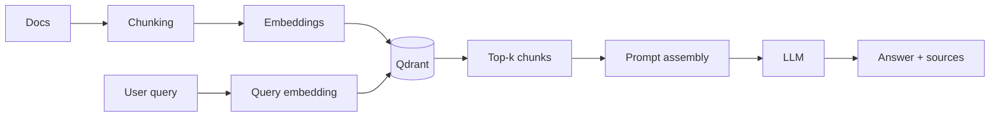

# RAG (Retrieval‑Augmented Generation)

Этот документ описывает, как мы используем RAG в сервисе: что именно извлекаем, как индексируем, как устроен пайплайн ответа, и какие есть «боевые» рекомендации по качеству, стоимости и безопасности.

## Зачем RAG

RAG нужен, когда:
- знания часто обновляются (внутренняя документация, runbooks, спецификации);
- нужен контроль источников (цитирование/трассировка);
- нельзя «вшивать» всё в промпт (лимит контекста, стоимость);
- важно снижать галлюцинации за счёт точного контекста.

## Термины

- **Корпус** — исходные документы (Markdown, PDF, HTML, Confluence-экспорт и т.д.).
- **Чанк** — кусок текста, который индексируется как отдельная единица.
- **Эмбеддинг** — векторное представление чанка.
- **Векторное хранилище** — база для поиска по близости (у нас: Qdrant).
- **Retriever** — компонент, который возвращает релевантные чанки по запросу.
- **Re-ranker** — (опционально) модель/правило, переупорядочивающее кандидатов.
- **Generator** — LLM, формирующая итоговый ответ.

## Базовый пайплайн

1. **Ингест**: читаем документы → нормализуем → режем на чанки.
2. **Индекс**: считаем эмбеддинги → пишем в Qdrant (payload: метаданные).
3. **Запрос**: считаем эмбеддинг вопроса → ищем top‑k чанков.
4. **Сбор контекста**: фильтры/дедупликация → (опционально) re-rank.
5. **Генерация**: LLM отвечает, опираясь на контекст.
6. **Трассировка**: сохраняем, какие чанки были использованы (для дебага/аудита).



## Чанкинг: практические правила

Хороший чанкинг — 50% качества RAG.

Рекомендации:
- Режьте по **структуре** (заголовки Markdown, списки), а не по «N символов».
- Старайтесь держать чанк в диапазоне **300–1200 токенов** (в зависимости от модели и домена).
- Делайте **overlap** (например 10–20%) для сохранения контекста на границах.
- Сохраняйте **иерархию заголовков** в metadata (например `h1/h2/h3`) — это помогает фильтровать и объяснять.
- Дедуплицируйте «шапки/футеры», шаблонные блоки, автогенерируемые меню.

### Пример метаданных (payload)

Минимальный набор, который окупается почти всегда:
- `doc_id` — стабильный идентификатор документа;
- `path` — путь/URL источника;
- `title` — заголовок документа;
- `section` — заголовок секции (h2/h3);
- `chunk_index` — порядковый номер чанка;
- `updated_at` — время последнего обновления (для reindex);
- `tags` — доменные теги (команда/сервис/компонент);
- `acl` — маркер доступа (если есть разграничение).

## Retrieval: top‑k, фильтры, re-rank

Базовые настройки:
- Начинайте с `top_k = 8…20`.
- Если используете re-rank, можно брать `top_k = 30…80`, затем сжимать до 8–15.

Фильтры в retrieval полезны для:
- сужения по `tags` или `service`;
- исключения устаревших/архивных документов;
- применения `acl` (обязательно для internal RAG).

Re-rank имеет смысл, когда:
- запросы короткие и неоднозначные;
- корпус большой и «похожих» чанков много;
- важна точность первых 3–5 чанков.

## Prompt assembly: как собирать контекст

Минимальный шаблон:
- Чёткие правила модели («используй только контекст», «если не хватает — скажи»).
- Контекст в виде списка источников, каждый с `id`, `path`, `section`.
- Требование приводить источники (если у нас это включено в продукте).

Пример структуры (псевдо‑формат):
```
System: Ты помощник… Следуй политике… Не выдумывай…
User: <вопрос>
Context:
  [S1] path=docs/rag.md section="Chunking" ... <text>
  [S2] path=... <text>
Instructions:
  - Ссылайся на источники в виде [S1], [S2]
  - Если ответа нет в контексте — так и скажи
```

## Качество: как измерять

Минимальная практичная метрика для команды:
- **Answer groundedness**: доля ответов, подтверждаемых источниками.
- **Citation correctness**: цитата действительно поддерживает утверждение.
- **Retrieval hit-rate**: в top‑k есть чанк, содержащий ответ (на наборе вопросов).
- **Latency**: время retrieval + время генерации.
- **Cost**: токены промпта/ответа + стоимость эмбеддингов.

Рекомендуемый процесс:
1) соберите 30–100 «живых» вопросов от пользователей;
2) прогоните офлайн с логированием top‑k;
3) вручную разметьте: «нашёл/не нашёл», «ответ верен/нет», «источник корректен/нет»;
4) правьте чанкинг/метаданные/фильтры до приемлемого уровня.

## Типовые проблемы и лечение

- **Модель «знает лучше» и игнорирует контекст** → усиливайте инструкции, уменьшайте температуру, добавляйте «ответ только из контекста».
- **Нерелевантные результаты** → улучшайте чанкинг, добавляйте фильтры, пробуйте re-rank, пересмотрите embedding‑модель.
- **Слишком длинный промпт** → снижайте top‑k, делайте сжатие (summary) контекста, объединяйте близкие чанки.
- **Конфликтующие источники** → добавляйте `updated_at`, выбирайте более свежий, явно указывайте пользователю расхождение.

## Безопасность и комплаенс (минимум)

- Не индексируйте секреты (ключи, токены). На ingestion добавьте детекторы и redaction.
- Для документов с разным уровнем доступа используйте `acl` и enforcement на retrieval.
- Логи запросов могут содержать PII: определите retention и маскирование.

## Что дальше

Если вы добавляете новый тип документа:
1) определите парсер → 2) правила чанкинга → 3) payload → 4) стратегию обновлений (reindex) → 5) тестовый набор вопросов.
